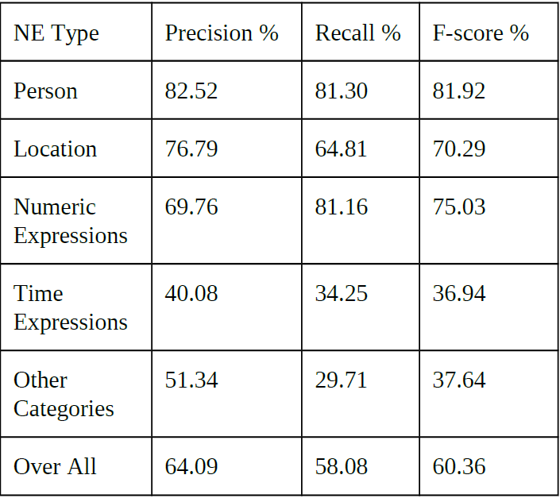
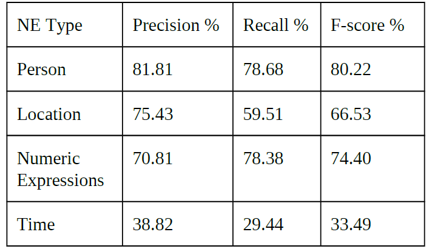
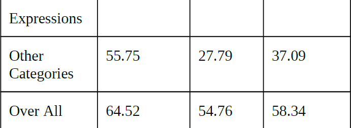
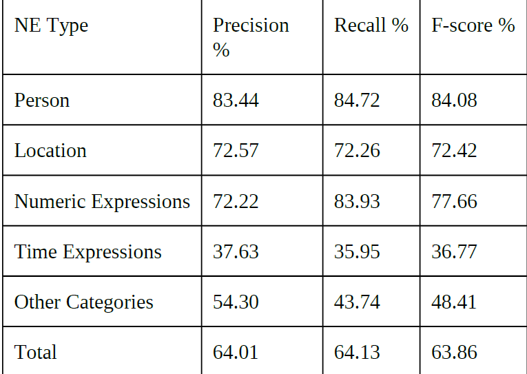
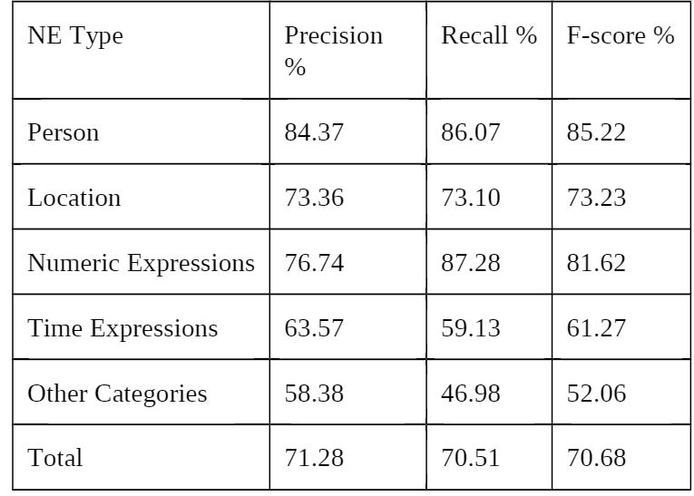

1 - Automated Named Entity Recognition from Tamil Documents

Challenges in tamil:
- partially free word order
- Sentence without SV or O
- No capitalization
- polysemic : single word with multiple meanings
- Ambiguity 
- Lack of resources
  
Features:
 - regex features : for dates
 - morphological features : case markers
 - Contextual features 

Method:
- naive bayes using the above features

Data:
- FIRE corpus

Evalutation:
- F-measure of 83.54%

2 - Named Entity Recognition in Tamil
Language Using Recurrent Based
Sequence Model

Data:
- Wikipedia crawling
- FIRE-2018 IECSIL shared task corpus.

Method:
- LSTM
- No Word2Vec or GloVE - does not consider internal structure of the words
- Uses FastText - considers ngrams thus morphology is learned to some extent
- Model : embedding, LSTM, Dense, Output Softmax

Evalutation:
- 

5-Tamil NER - Coping with real time challenges

NER techinques:

  - Rule based techinque using max entropy
  - using HMM
  - bootstrapping approach using concept based seeds and using maximum entropy markov model
  - CRF model   
  
To improve NER models:

  - using dataset with distributional similarity, lexicon,term co-occurences and language cues.
  - combining the above mentioned global charactersitics with the local context improves accuracy.

problems:

  - In HMM there is a dependency problem
  - MEMM have labeling  bias problem
  
Tagset:

  - hierarchical tagset (106 tags)
  - Mainly three classes
      - Entity Names (ENAMEX)
      - Numerical Expressions (NUMEX) 
      - Time Experessions (TIMEX)
        
Features:

  - Individual words
  - POS tag of words
  - combination of word and POS
  - chunk - noun phrase,verb phrase
  - combination of word,POS and chunk
    
Dataset:

  - The corpus is collected from online tourism sites.It consits of 93k words.
  - Train and  test are split  into 70% and 30%.
    
challenges in Tamil:

  - Agglutination - Case Markers attached  to proper or common nouns to form a single word.
  - Ambiguity - same word different meaning in a sentence.
  - Nested Entities 
  - Spell Variations
  - Name variations
  - Capitalization
  - Noise in the data ex:HTML tags
    
Evaluation:
  - CRF model
 
    
    
  - Yamcha SVM model

    
    
    
  - Solution for agglutination is considering the root word instead of the actual word.
  
    
    
  -  Evaluation results – after the application of root word and heuristic rules post.
    
   
    
8 - Named-Entity-Recognition (NER) for Tamil Language Using Margin-Infused Relaxed Algorithm (MIRA)

Data: 
- An annotated corpus of 125,000 words is created from the Tamil BBC newspaper articles. May be provided by FIRE.
- A Gazetteer is created with 100,000 names of people from Sri Lanka from Department of Registrations of Persons Sri Lanka

Entities: INDIVIDUAL, PLACE, ORGANIZATION, COUNT AND TIME

Features:
- Contextual length (window size)
- Part-of-Speech (POS) tag:
   - Part Of Speech tagging is marking up a word in a text with a corresponding predefined part of speech tag.
   - Stanford PoS tagger is used to build a Tamil PoS tagger. The standard PoS definition has 32 tags . Classification into higher number of classes ended up in higher error rates. Hence, tags set is defined in manner where 21 tags are used. 80,000 words are tagged manually and used as training data for the tagger. These tags are NN, NNC, RB, VM, SYM, PRP, JJ, NNP, PSP, QC, VAUX, DEM, UT, QF, NEG, QO, CC, WQ, INTF, NNPC and RBP1.
- Noun and verb phrases derived from the morphological analyzer:
   - Identifies stem of the word and derive noun/verb tag for the word.
- Gazetteers:
   - A Gazetteer is created with 100,000 names of people from various ethnic groups.
   - Some of these transliterated names (names from other languages) lead to inaccuracies in the Tamil context. Such conflicting names are very rare; therefore, such names were removed from the Gazetteer.
- Surefire rules:
   1.	For individuals: there is a high chance that a name of an individual follows after titles such as Mr., Mrs., Prof., Dr.
   2.	For organizations: there is a set of starting and ending words such as station, department, organization, university and so on.
   3.	Prefixes and suffixes
   4.	Orthographic features: Orthographic features are like a pattern, which match a tokenized word. For example, “X” is used as a placeholder to represent Tamil characters whereas digits are denoted with the letter “N”.
   5.	Length of word

ALgorithm:

Margin-Infused Relaxed Algorithm (MIRA): 
  MIRA is an online algorithm, which is based on error minimization. It makes use of a matrix to build a model. In each iteration, different matrices are considered by making a small change to the parameters of the earlier matrix and the matrix that makes the lowest error is selected as the final matrix. Likewise, iterations are continued throughout the training data and final matrix is discovered.

Evaluation:
- F1 measure of 81.38%

9 - Randomized Kernel Approach for Named Entity Recognition in Tamil

Data: Forum of Information Retrieval and Evaluation, Named Entity Recognition Track (FIRE) dataset.

Labels: PERSON, LOCATION AND ORGANIZATION

Algorithm: 

Random Kitchen Sink (RKS) algorithm: 
  RKS is a machine learning algorithm for nonlinearly separated data sets. The main advantage of Random Kitchen Sink algorithm is independent of the number of data points. So, this method is suitable for systems like Natural Language Processing applications which require large dataset.
  
Evaluation:
- F1 measure of 86.61%
  
10 - Named Entity Recognition in Tamil from Code Mix Social Media Text

Challenges in Social Media Named Entity Recognition:
- Tweets contain a huge range of distinct named entity types. Almost all these types (except for People and Locations) are relatively infrequent, so even a large sample of manually annotated tweets will contain very few training examples.
- Twitter has a 140-character limit; thus, tweets often lack sufficient context to determine an entity’s type without the aid of background or world knowledge.
- In comparison with English, Indian Languages have more dialectal variations. These dialects are mainly influenced by different regions and communities.
- Indian Language tweets are multilingual in nature and predominantly contain english words.

Data: The corpus was collected using the twitter API in two different time periods.

Labels:
- In this tag set, named entity hierarchy is divided into three major classes; Entity Name, Time and Numerical expressions. 
- The Name hierarchy has eleven attributes (Person, organization, Location, Facilities, Cuisines, Locomotives, Artifact, Entertainment, Organisms, Plants and Diseases).
- Numeral Expression have four attributes (Distance, Money, Quantity and Count).
- Time Expression have three attributes (Time, Year, Month, Date, Day, Period and Special day).
- The top level (or 1st level) hierarchy has 22 tags, the second level has 49 tags and third level has 31 tags. Hence a total of 102 tags are available in this schema.

Features:
- statistical suffixes
- window of three words

Algorithm:

Conditional Random Fields (CRFs):
  Conditional Random Field (CRF) is a statistical method which can be applied on machine learning problems for prediction. CRF is a type of probabilistic model which is used for labeling in Natural Language Processing. CRF advances than other algorithms by including long range dependencies which avoids biasing problems. 
  
Features:
- statistical suffixes
- window of three words 
  
Evaluation:
- F1 measure of 70.93%

Errors:
- Named entities occurring in adjacent positions are tagged as single entity (two NEs combined as one NE).
- one named entity with multiple tokens is tagged as two entities (Single NE split as two NEs).
- NE boundary is not identified properly, beginning of an entity is tagged by intermediate tag, part of an entity is tagged by the system (as BIO format of tagging is followed by the system.
- Organization names are not identified correctly.
